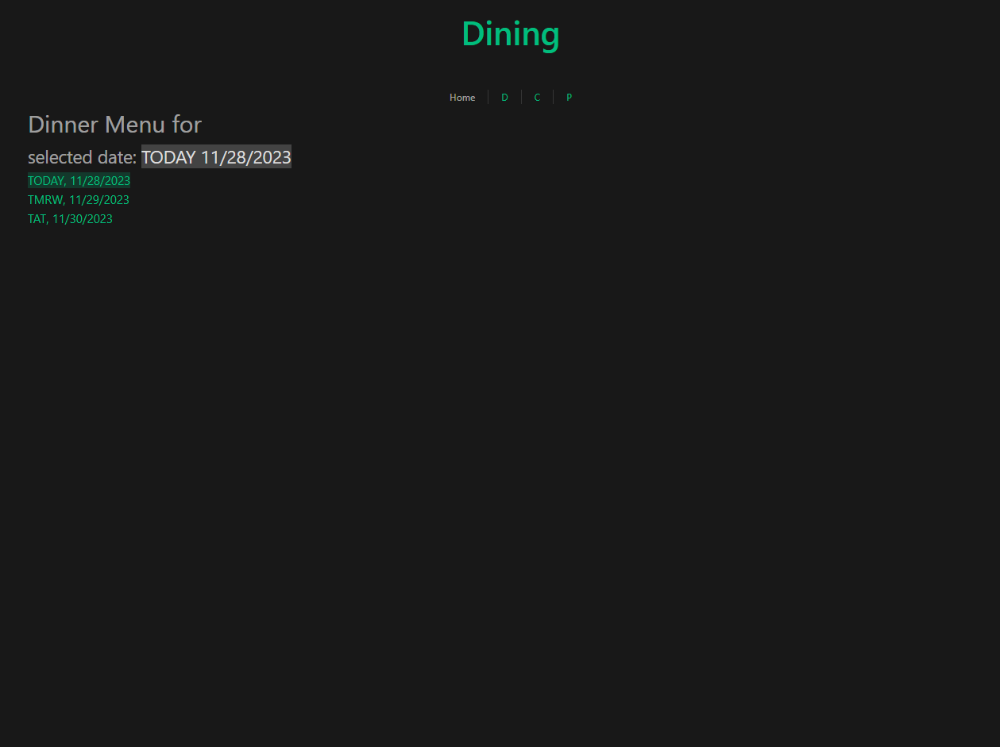
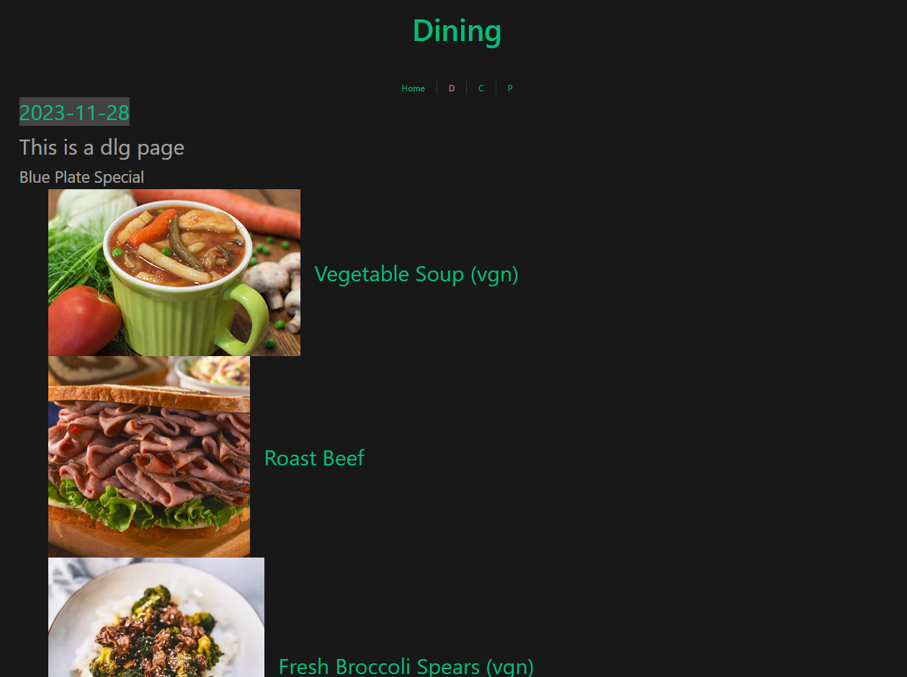
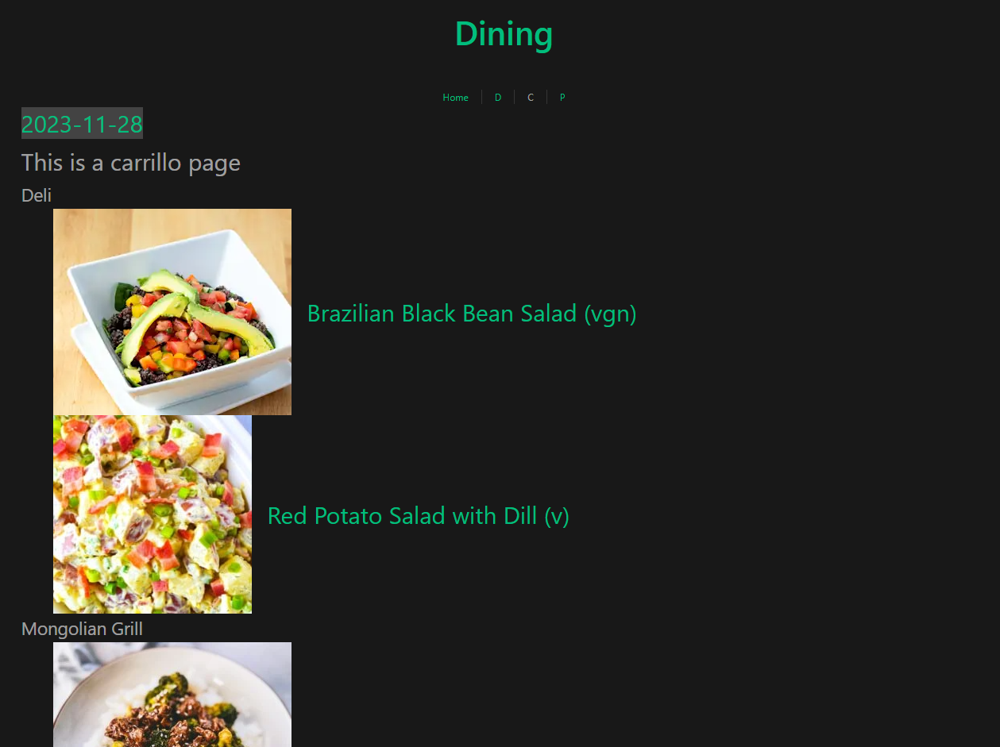
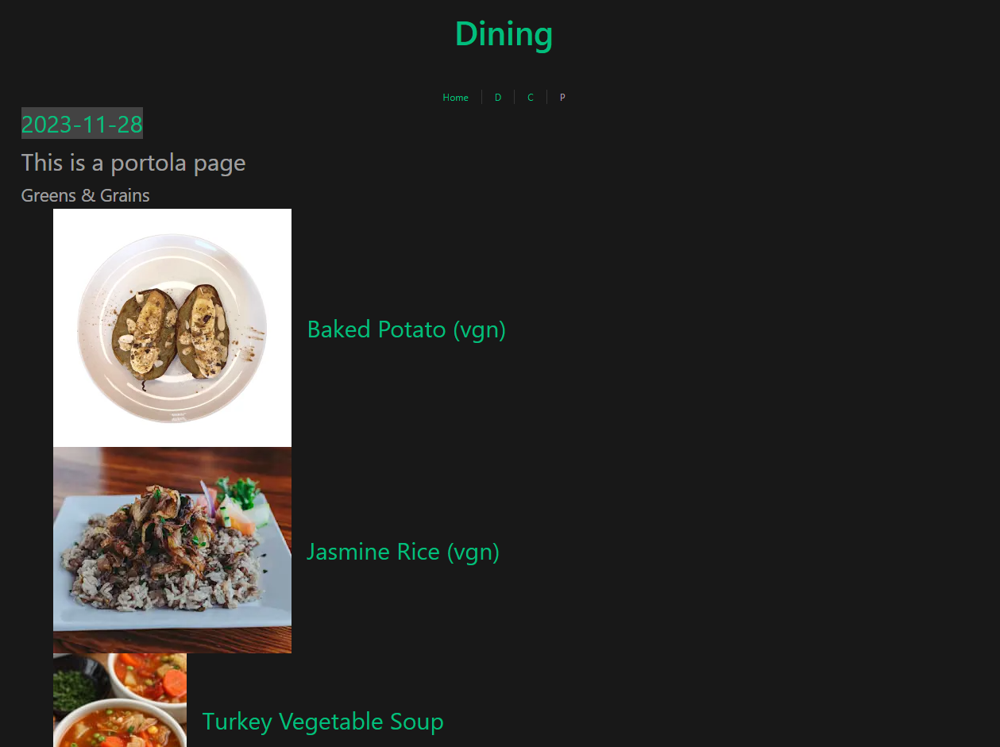

# 학교식당 저녁 메뉴
- 학교식당이 3곳이 있는데 메뉴가 다르다.
- 학교 공식 사이트에서 메뉴를 볼수있다.
- 하지만 음식 사진이 없다. 가끔 모르는 음식이 있다면 사진을 찾아봐야한다.
- 음식사진들을 구글에서 가져와서 3곳 중 가장 맛있을 거 같은 식당에서 저녁밥을 먹자.

#### starting server
```
npm run start
```
[#mysql](https://www.mysql.com/), [#express](https://expressjs.com/) [#google-search-api](https://developers.google.com/custom-search)
#### starting client
```
npm run dev
```
[#vue](https://vuejs.org/)

#### current progress
<div>
    <br/>
    <br/>
    <br/>
    <br/>
</div>


